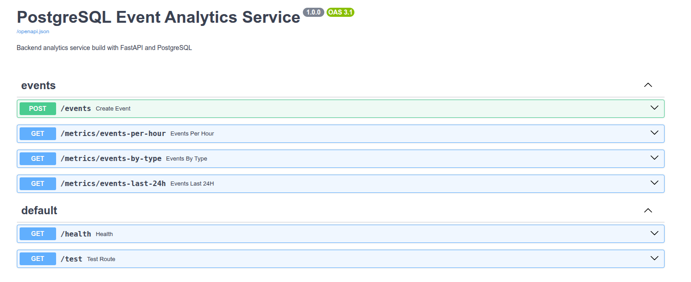
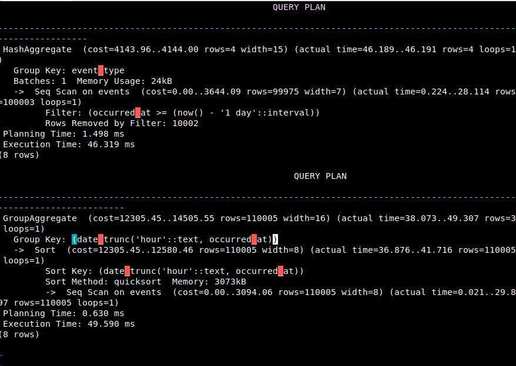

# TicketFlow Backend Service

Production-style backend service for ticket lifecycle management and operational analytics built with:

* PostgreSQL
* FastAPI
* asyncpg
* Nginx
* Ubuntu Server

The project explores:

* async backend architecture
* PostgreSQL optimization
* time-series partitioning
* aggregation pipelines
* structured logging
* deployment and observability
* ticket workflow analytics

Tested with approximately:

* **1,000,000 ticket lifecycle events**

## Engineering Practices

This project includes:

- database migrations (Alembic)
- automated testing
- GitHub Actions CI
- structured logging
- API versioning strategy
- deployment automation

---

# Project Overview

TicketFlow is a backend-focused project designed to simulate a production-style ticket and workflow management platform.

The system tracks ticket lifecycle activity such as:

* ticket creation
* assignment changes
* status transitions
* priority updates
* resolution events

The project focuses on how backend systems ingest, store, query, aggregate, and expose operational workflow data at scale.

Core engineering areas explored include:

* PostgreSQL schema design
* query optimization using `EXPLAIN ANALYZE`
* async API development with FastAPI
* time-series partitioning strategies
* aggregation pipelines
* connection pooling
* deployment using Nginx and systemd
* structured logging and observability

---

# Current Scale

The system has been tested with approximately:

* **1,000,000 ticket lifecycle events**

This larger dataset makes indexing, partitioning, aggregation, and query optimization behavior more realistic and meaningful.

---

# Roadmap

Planned future improvements include:

* ticket assignment workflows
* SLA tracking
* comment threads
* audit history
* role-based permissions
* notification system
* dashboard frontend

---

# Architecture

```text
Users / Support Staff
        │
        ▼
FastAPI Backend API
        │
        ▼
PostgreSQL Database
        │
        ├── Ticket Lifecycle Events
        ├── Time-Based Partitions
        └── Aggregated Workflow Metrics
        │
        ▼
Analytics and Reporting Endpoints
```

---

# Screenshots

## API Documentation



## Query Analysis



---

## Screenshots

### API Documentation


### Query Analysis


