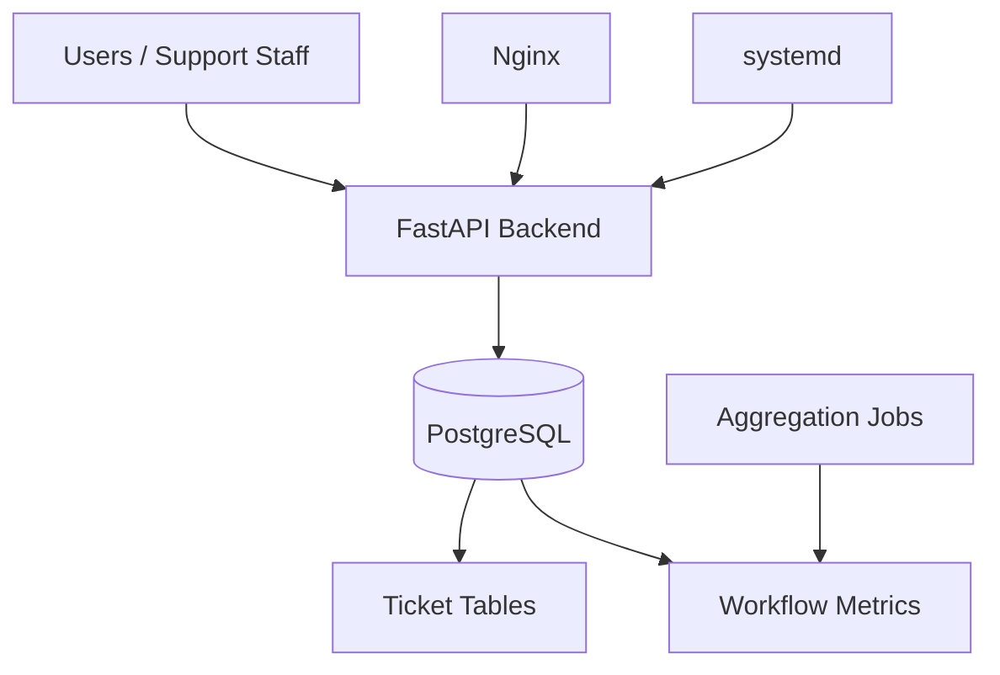
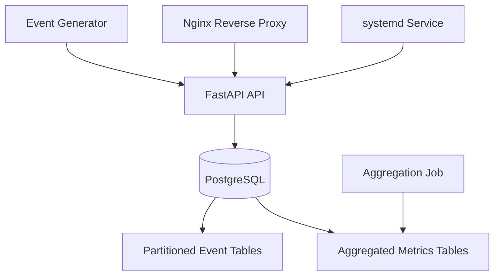

# Architecture Diagram

```mermaid
flowchart TD

A[Users / Support Staff] --> B[FastAPI Backend]

B --> C[(PostgreSQL)]

C --> D[Ticket Tables]
C --> E[Workflow Metrics]

F[Aggregation Jobs] --> E

G[Nginx] --> B

H[systemd] --> B
```

#Previous Archiecture

```mermaid
flowchart TD

A[Event Generator] --> B[FastAPI API]

B --> C[(PostgreSQL)]

C --> D[Partitioned Event Tables]
C --> E[Aggregated Metrics Tables]

F[Aggregation Job] --> E

G[Nginx Reverse Proxy] --> B

H[systemd Service] --> B
```
